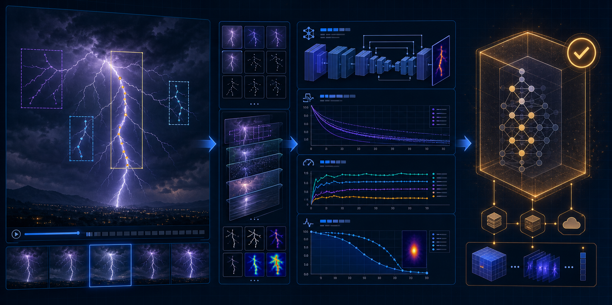

<p align="center">
  
</p>

# Lightning Strike Extractor Training

Independent dataset and detector development for the
[Lightning Strike Extractor CLI](https://github.com/andregasser/lightning-strike-extractor).

This repository owns the complete model lifecycle: importing neutral frame
handoffs, preparing annotation campaigns, creating immutable dataset releases,
training and evaluating detector candidates, and exporting verified ONNX model
bundles. It is deliberately independent from the video-analysis CLI and must
never import or install `lse`.

The [product repository](https://github.com/andregasser/lightning-strike-extractor)
consumes one thing from this project: a released ONNX bundle with a manifest and
checksums. Training checkpoints and framework-specific details never enter the
product distribution.

Together, the repositories form a deliberately separated pipeline: the CLI
analyzes videos and creates provenance-rich frame handoffs; this repository
turns those handoffs into verified datasets, trained models, and versioned ONNX
releases for the CLI.

## Boundary and data flow

```text
lightning-strike-extractor             lightning-strike-extractor-training
────────────────────────────           ───────────────────────────
raw video                              frame handoff
    │                                  │
    ├─ lightning analyze                ├─ import-handoff
    └─ frame/provenance export ────────┼─ annotation campaign
                                       ├─ verified dataset release
                                       ├─ train + evaluate
                                       └─ ONNX release ────────────┐
                                                                   │
                         product model promotion ◄────────────────┘
```

The handoff is a file contract, not a Python API. The source video remains in
the CLI environment; this project receives selected images, source identity,
timestamps, candidate metrics and SHA-256 checksums.

## Setup

Requirements: Python 3.11+, [uv](https://docs.astral.sh/uv/), and a suitable
PyTorch installation for the selected training hardware.

```bash
git clone git@github.com:andregasser/lightning-strike-extractor-training.git
cd lightning-strike-extractor-training
uv sync --extra train --extra dev
```

The product CLI is not required and must not be installed in this environment.

## Import a CLI frame handoff

Create a neutral handoff in the video repository:

```bash
uv run python -m lse.dataset_export runs \
  --output /path/to/frame-export
```

Import it here:

```bash
uv run lse-train import-handoff /path/to/frame-export \
  --output campaigns/storm-2026-08
```

The importer validates schema version, safe relative paths, source identity,
image decoding, duplicate filenames and hashes, and SHA-256 checksums. It
atomically creates annotation tasks, a label configuration, served images and a
campaign manifest. Provenance remains attached to every task.

## Annotation and verified data

Annotate every task, including true negatives. A visible channel uses the
single class `lightning_channel`; an image without a channel remains a valid
negative example.

The handoff importer stops at an annotation campaign. Conversion from completed
annotation exports into a verified, source-grouped dataset is a separate step in
this repository. Do not train directly from an imported campaign or unreviewed
proposals.

The release builder expects:

```text
verified-dataset/
├── manifest.json
├── annotations/
│   ├── instances_train.json
│   ├── instances_validation.json
│   └── instances_test.json
└── images/{train,validation,test}/
```

Complete source videos must remain in exactly one split. Splitting adjacent
frames from the same source across train and test produces misleading metrics.

## Build an immutable dataset release

```bash
uv run lse-train release /path/to/verified-dataset \
  --release-id lightning-2026.08.1 \
  --output releases/lightning-2026.08.1
```

The release builder accepts only human-verified annotations, validates image
dimensions, paths and boxes, deduplicates identical image content by SHA-256,
rejects conflicting annotations and source/split conflicts, refuses to overwrite
an existing release, and writes source assignments and output checksums.

Releases are immutable inputs to experiments. Create a new release ID when data
changes; never edit an existing release in place.

## Train and evaluate

The current implementation provides a reproducible Faster R-CNN/MobileNet
baseline. It is a reference point, not a final architecture decision.

```bash
uv run lse-train train releases/lightning-2026.08.1 \
  --output experiments/baseline --epochs 10 --seed 17

uv run lse-train evaluate releases/lightning-2026.08.1 \
  experiments/baseline/checkpoint.pt --split validation \
  --output experiments/baseline/validation.json
```

Evaluation reports true positives, false positives, false negatives, precision
and recall at a documented IoU and confidence threshold. Compare multiple
architectures on the same release before production promotion.

## Export and verify ONNX

```bash
uv run lse-train export-onnx experiments/baseline/checkpoint.pt \
  --training-report experiments/baseline/training.json \
  --evaluation-report experiments/baseline/validation.json \
  --version 0.1.0 --output releases/model-0.1.0
```

The exporter validates the graph, runs ONNX Runtime, compares ONNX outputs with
PyTorch outputs, and writes this bundle atomically:

```text
releases/model-0.1.0/
├── model.onnx
├── manifest.json
└── checksums.json
```

The manifest fixes preprocessing, tensor names, class schema, thresholds,
opset, runtime compatibility, dataset provenance and artifact hash.

## Promote a model to the product

Promotion is explicit. After reviewing evaluation and ONNX parity, copy the
released artifact into the product repository and update its manifest. The
product runtime then validates the checksum and tensor contract. The training repository
never pushes a model directly into a production checkout, and the product never
downloads research checkpoints implicitly.

## Repository layout

```text
src/lse_train/
├── handoff.py          # frame handoff validation and campaigns
├── coco.py             # verified dataset validation
├── release.py          # immutable dataset releases
├── training.py         # baseline training
├── evaluation.py       # candidate evaluation
├── onnx_release.py     # export and parity checks
└── cli.py              # lse-train entry point
tools/                  # annotation-format adapters and local utilities
tests/                  # deterministic training tests
```

## Development checks

```bash
uv sync --extra train --extra dev
uv run pytest -q
uv run ruff check .
```

Before committing substantial changes, review the complete affected path:
artifact schemas, failure behavior, resource usage, input-path security,
reproducibility, tests and documentation.

## Status

The repository contains the independent lifecycle infrastructure and a baseline
detector. No model is production-ready until it has been evaluated on a real,
source-isolated test set and its ONNX bundle has passed parity checks.
